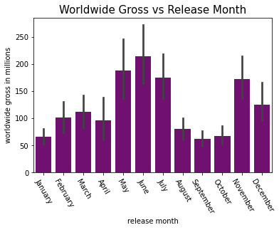
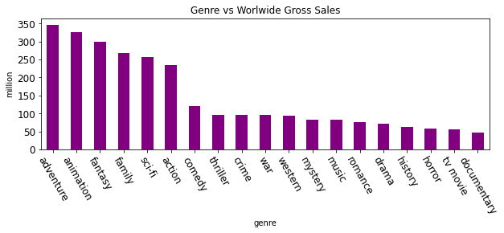
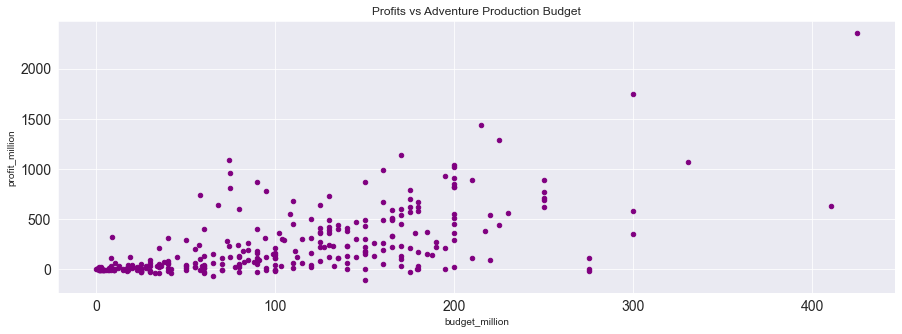
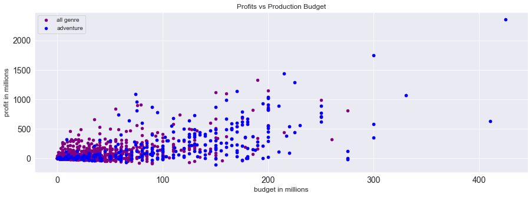

# Microsoft Movie Analysis

Nancy Lopez

## Overview
I have been assigned to help Microsoft in its very first movie venture. Since this will be the first movie they will be making I had to take a look at movies from the past and see why they have done so well. After gathering statistical data, I have been able to make recommendations to Microsoft. I have found releasing a movie in June has potential earnings of around 214 million. It is a great month to release a movie and doing an adventure movie will give us a great outcome with millions of gross sales. The average amount an adventure movie makes is 347 million, 145 million above average! Going with a production of an adventure movie has very promising high returns. But what is the cost of making such a great movie? From knowing adventure movie is the best movie kind of movie to make, I now needed to take a look at what will be a good budget with a great profit. The average amount movie production budget is 52 million with 81 million return profit, about 156% return. Adventure movie's average budget is 105 million with a return of 242 million in profits, a 230% return! We also can see a positive correlation between budget and profit, the more it is budgeted the higher the return on profit. After evaluating the data, I am confident Microsoft will be able to make a successful movie by following the recommendations provided.

## Business Problem
Since this is Microsofts first movie they have no idea where to start. In order to give the best solution I have to dig deep and find what has made movies in the past success. I am going to look at movies with the highest gross sales and make three strong recommendations based on my findings. In my analysis, I am going to need to find out if the amount budgeted for the production of the movie returns a higher net profit. I would also like to know if movies released on a certain month throughout the year have higher sales than other months. Lastly, what type of genre movies tend to draw higher net profits. Based on my analysis I will able to provide Microsoft recommendations that will help its first movie be a great success.

## Data 
Data was gathered from various sources in order to develope a great analysis. On source used was Box Office Mojo it includes data of the amount each movie grossed. Which also included studio and release year. Data was also gathered from The Number, a dataset with movie production budgets, worldwide gross and domestic gross. Lastly, The Movie DB a dataset containing genre and release dates of the movies in the dataset. 


## Methods
Once the data was imported, I started to clean the data to help make a proper analysis to answer the business problem. I started by first removing anything that we did not need: columns, null values, and duplicates. After all data was cleaned I grouped the data together to get the nesscary findings I needed.

## Results


#Gross sales by release month




Based on our graph we can see towards the summer month there is a rise in worldwide gross sales based on our release months rising. June is the month with the highest gross sales, with a mean in June is 214 million. Proving to us it is a great month to release a movie. A month not to release a movie with a mean only of 62 million in September. Not only is it the lowest month, but it is also less than half of June's gross sales worldwide

#Genre Vs Gross



Adventure movies have the highest worldwide gross sales at 347 million vs other movies genre. Even though alot of movies are drama movies, they fall under the first quartile of 74 million. 25% of our data falls below the 74 million which is not a good spot to be when a movie is trying to make the most worldwide gross sales. A adventure genre movie has a better chance fo success. Even animation with 323 million and fantasy with 300 million do not fall far behind. They are still over the average of 202 million compared to other genre movies in worldwide gross.

#Profit Vs Budget



The average amount bugeted for movies is 39 million with a profit average of 82 million. I also found only 25% of movies went past a 50 million budget and the thrid quartile in movie profits were 77 million which is really close to our average profit of movie sales. Also also on the graph there is a positive correlation between profits and movie production budgets. The higher movie production budget is, the higher of a possible movie profit will return high.




After going back and doing my reanalysis, there is a slightly higher budget for adventure movies. Even though the average budget spent is 105 million and half the movies spent at least over 97 million with an average of 242 million. An adventure movie with a production budget of 100 million has a high chance of it returning more than double the profit.


## Conclusion
After my evaluations I would like to recommend the following to Microsoft for their first movie venture:

**Release Month**

June proved to us it is the best time to release a movie with worldwide gross sales of 214 million. While September would be a month to avoid, it was the lowest month in gross sales with only 62 million.

**Genre**

Aventure Compared to other movie genres an adventure movie has the highest worldwide gross of 347 million. Also, it surpasses the average worldwide gross of all genres by 202 million!

**Production Budget**

The production budget should be aimed to be at 100 million. It has a high potential to return double in profits of what is spent on production.

I am confident Microsoft will be able to make a great movie based on these recommendations.

### Next Steps
Do another analysis with newer data to include newer movies
Do a further analysis of movie ratings and see what kind of adventure movies do best


Please view full analysis in [Jupyter Notebook](https://github.com/nv593/microsoft_movie_analysis/blob/main/movie_analysis_project.ipynb) or [presentation](https://github.com/nv593/microsoft_movie_analysis/blob/main/Movie_Analysis.pdf)

### Repository Structure

```
├── Graphs
├── Genre_VS_Gross.png
├── Profit_VS_Budget.png
├── Profit_VS_Budget_1.png
├── Release_Month.png
├── zippedData
├── Movie_Analysis.pdf
├── README.md
├── movie-analysis.ipynb
